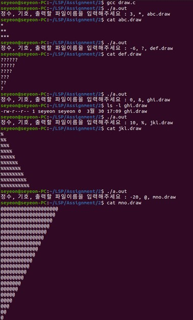
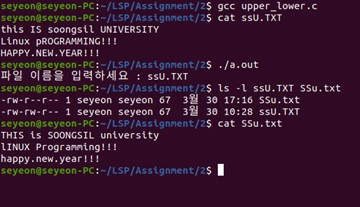
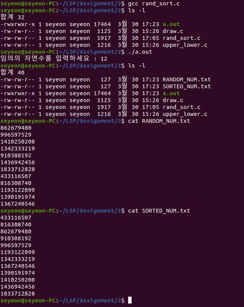

# 파일 입출력과 시스템 콜을 이용한 간단한 C 프로그램 구현
## 1. 정수, 기호, 파일이름을 입력받아서 삼각형 출력하는 프로그램 (draw.c)

- - -
   
## 2. 파일 이름과 내용에 있는 알파벳의 대소문자 변환 (upper_lower.c)

- - -

## 3. 임의의 자연수를 입력받아 숫자만큼 파일 출력 또는 정렬하여 출력 (rand_sort.c)

