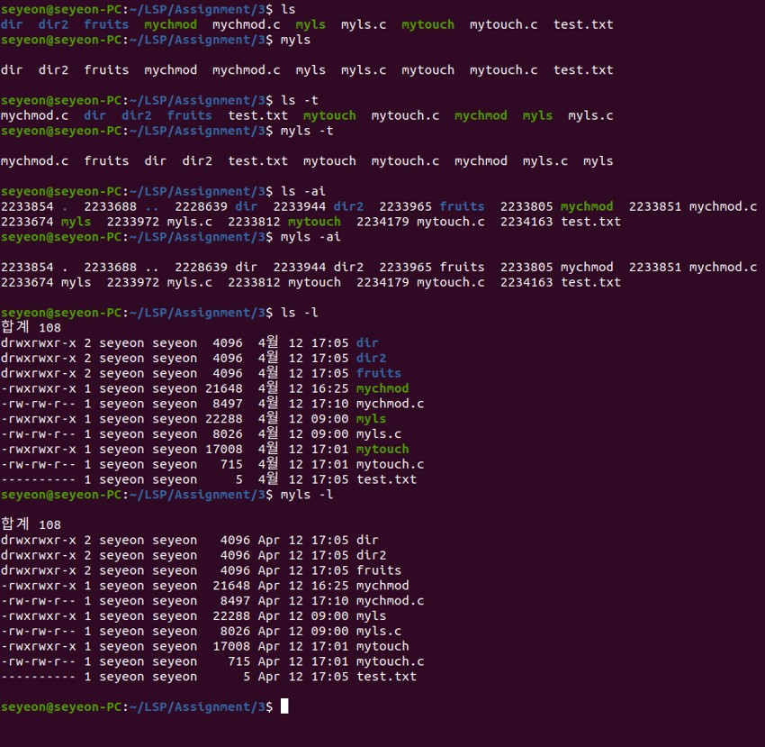
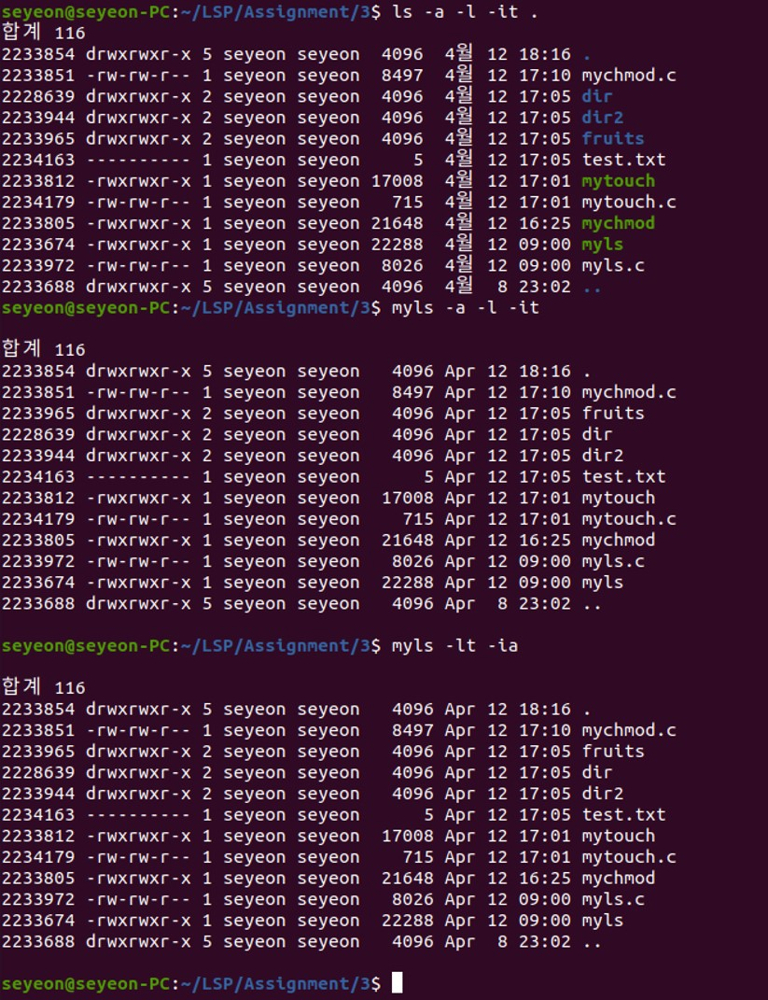
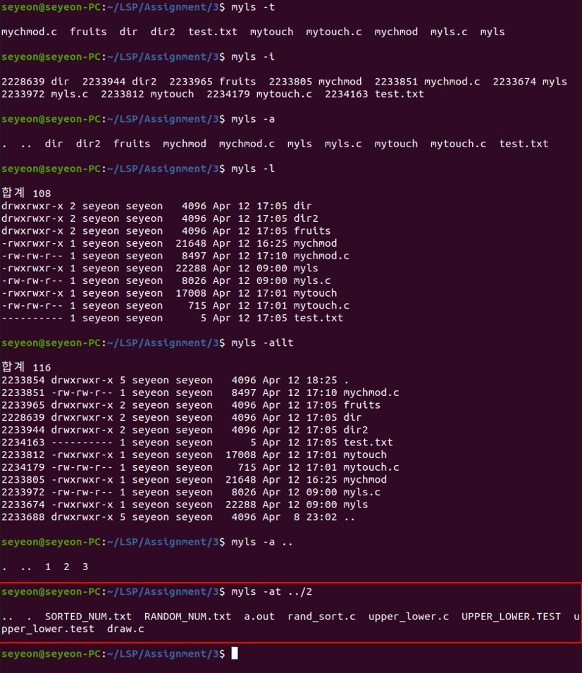
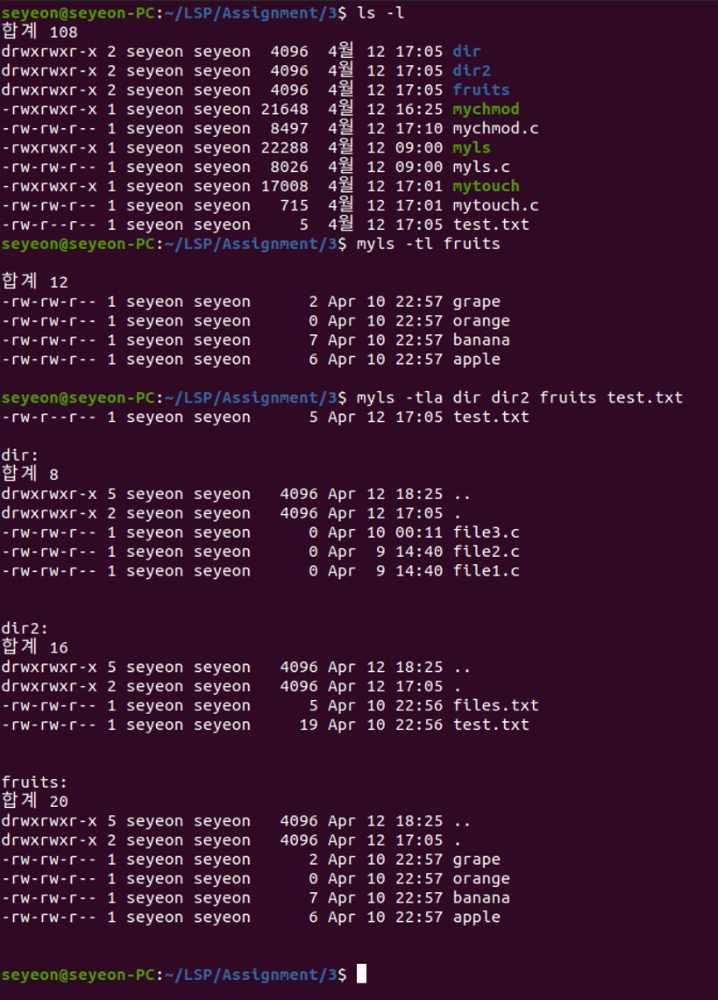
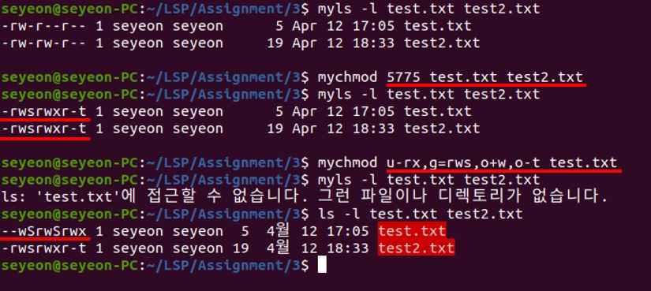
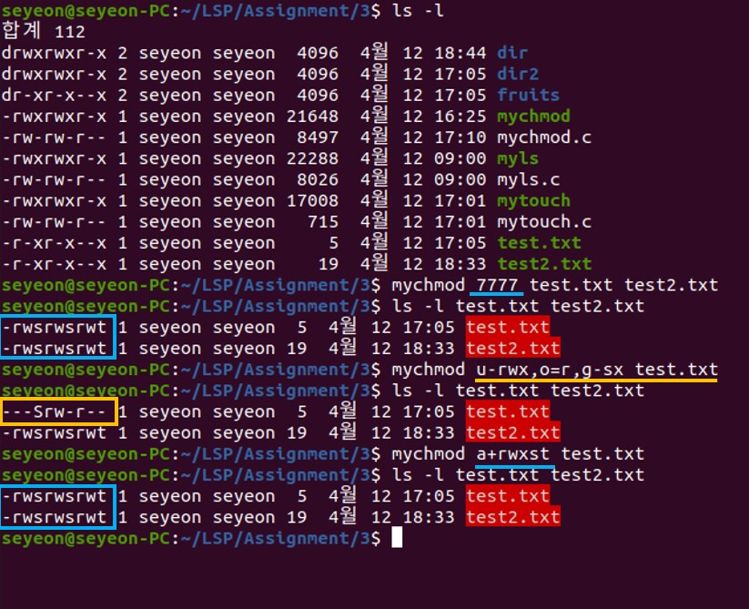
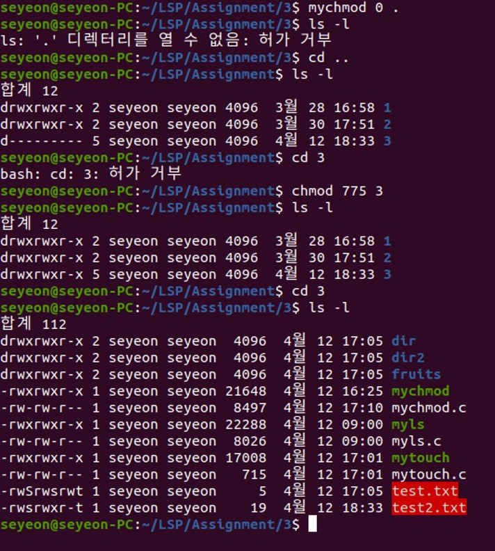
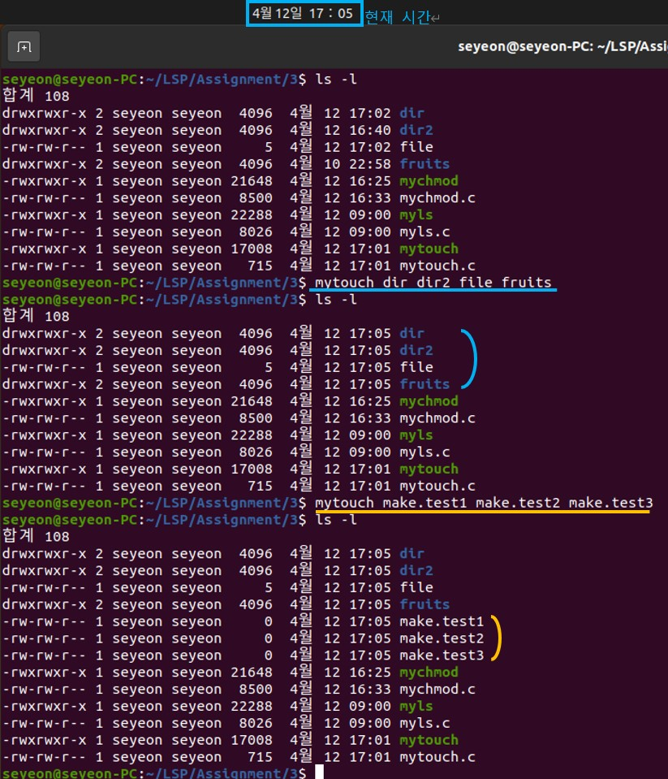

# Linux 쉘 명령어 ls, chmod, touch 구현
## 1. 파일의 목록을 표시하는 ls 명령어 구현 (myls.c)
* 구현 개요
    * myls는 기본적으로 오름차순 정렬이 되도록 구현
    * 여러 개의 파일과 여러 개의 디렉토리를 한번에 입력받아 출력할 수 있음
    * 옵션 추가
        * -a : 숨겨진 파일이나 디렉토리까지 모두 보여주는 옵션
        * -i : inode 번호까지 보여주는 옵션
        * -t : 파일이 수정된 시간을 기준으로 정렬하여 출력하는 옵션
        * -l : 권한, 하드링크 수, 소유자명, 그룹명, 파일크기, 수정일자, 파일이름 등을 자세한 내용을 리스트로 출력하는 옵션 
* 실행 결과   
   </img> 
   </img> 
   </img> 
   </img> 
   </img> 
- - -
   
## 2. 파일이나 디렉토리의 권한을 변경하는 chmod 명령어 구현 (mychmod.c)
* 구현 개요
    * mychmod [권한(기호모드 or 숫자모드)] [1번째 파일 or 디렉토리] … [N번째 파일or디렉토리] 순으로 표준 입력을 받으면 해당 권한으로 각 파일 및 디렉토리의 권한 변경
    * 숫자 모드
        * 입력받은 숫자를 비트 연산과 쉬프트 연산으로 이진수 값을 만들어 stat 파일안의 st_mode와 같은 값으로 파일의 접근권한을 변경
    * 기호 모드
        * a는 전체사용자, u는 현재사용자, g는 그룹사용자, o는 다른사용자의 접근권한을 의미
        * +는 권한추가, -는 권한해제, =는 권한지정 하는 연산자를 의미
        * r, w, x, s, t는 각각 읽기 권한, 쓰기 권한, 실행 권한, 사용자 및 그룹의 effective id, sticky bit 등을 의미
* 실행 결과     
   </img> 
   </img> 
   </img> 
- - -

## 3. 파일을 생성하거나 파일의 수정 시간을 갱신하는 touch 명령어 구현 (mytouch.c)
* 구현 개요
    * 파일이 존재하지 않는다면, 파일의 크기가 0인 빈 파일을 생성
    * 파일이 존재하면, 파일의 수정 시간을 현재 시간으로 변경
* 실행 결과     
   </img> 
