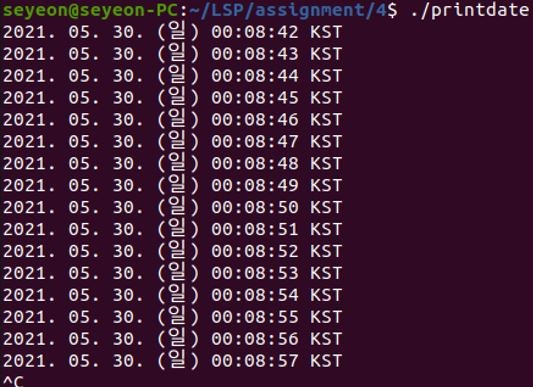
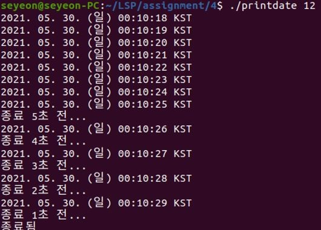
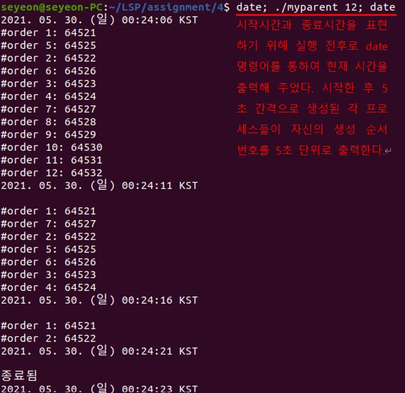

# Linux 자식 프로세스 생성을 통한 시그널 실습
### 1. exec을 통해 시그널이 오면 date 출력하는 프로그램 (printdate.c)
* 구현 개요
    * timelimit 인자로 받아 1초에 한번씩 현재 시간을 ‘date’ 명령어 실행을 통해 출력
    * timelimit 인자 없이 실행할 경우, 시간 출력을 무한 반복하도록 구현
    * timelimit 인자 있는 경우, 값 만큼의 시간이 지난 후 강제 종료
        * 강제 종료 5 초 전부터 종료 예정 카운트다운 출력
>
* 실행 결과     

    * timelimit 인자가 입력되지 않은 경우(SIGINT로 강제종료)   
   </img> 
   
    * timelimit 인자가 입력된 경우(시간이 다 되면 SIGTERM으로 강제종료)  
   </img>    
- - -
   
### 2. alarm( ), signal( ), raise( ) 시스템 콜을 이용한 프로그램 (myparent.c)
* 구현 개요
    * numofchild(초 단위 입력, 1 ~ 60) 개의 프로세스를 차례로 생성
    * 생성된 프로세스들은 자신의 생성 순서 번호를 5 초 단위로 출력
    * 부모 프로세스는 프로세스 생성 완료 후 5 초 후부터 생성된 순서의 역순으로 1 초에 하나씩의 프로세스를 종료
    * 생성한 프로세스를 모두 종료한 후에는 종료 메시지 출력 후 스스로 종료함
>
* 실행 결과     

    </img> 
