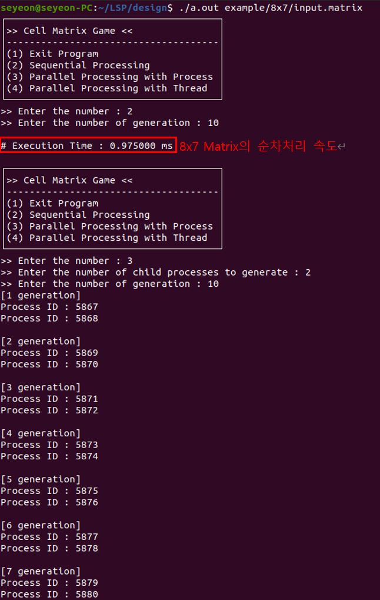
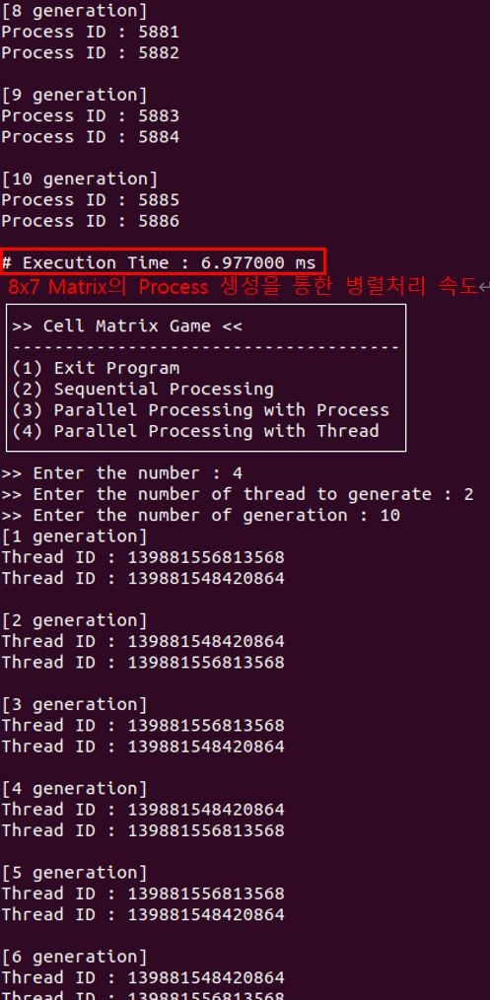
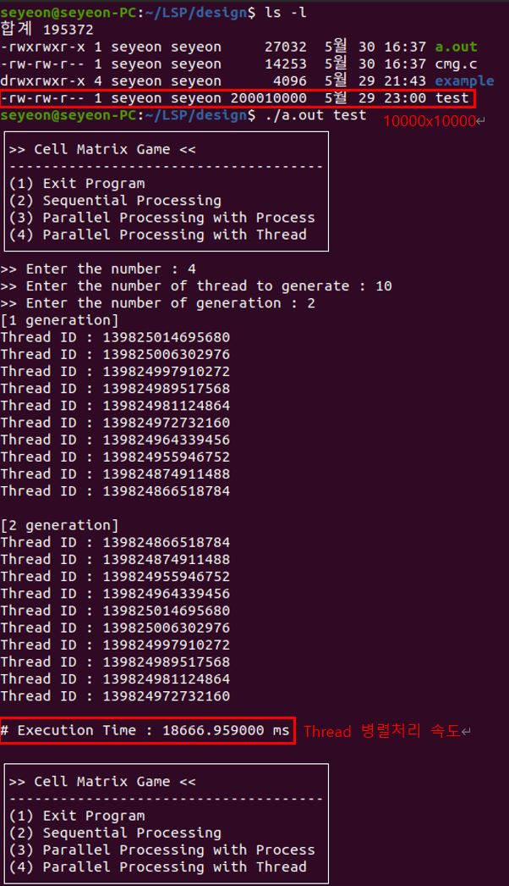
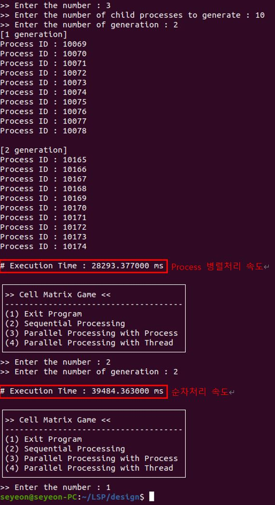

# Linux System에서 Process 및 Thread를 통한 병렬 처리 프로젝트
## 세포 매트릭스 게임 구현 (game.c)
* 게임 진행 규칙   
    * (m x n) 크기의 2차원 매트릭스를 입력으로 받음   
    * 입력받은 2차원 매트릭스의 한 칸은 하나의 세포라고 가정   
    * 하나의 세포에 이웃하는 8칸은 이웃 세포라고 가정
    * 세포 칸에 값 1이 들어있으면 살아있는 세포, 0이 들어있으면 죽은 세포라고 가정(단, 세포 칸의 값은 0과 1 이외의 값은 갖지 않는다)
    * 가장자리 세포들의 경우 매트릭스 밖의 이웃 세포는 모두 0이라고 가정
    * 임의의 값으로 설정된 “input.matrix” 파일로 입력되는 2차원 매트릭스를 0세대라 한 후, 각각의 모든 세포에 대해 아래의 규칙을 적용한 후 나오는 결과를 다음 세대로 정함(예: 0세대 다음은 1세대, 4세대 다음은 5세대)   
        1. 해당 세포가 살아있을 때, 살아있는 이웃 세포의 수가 2개 이하 혹은 7개 이상인 경우 해당 세포는 다음 세대에 죽는다.
        2. 해당 세포가 살아있을 때, 살아있는 이웃 세포의 수가 3개 ~ 6개인 경우 해당 세포는 다음 세대에 살아서 유지된다.
        3. 해당 세포가 죽어있을 때, 살아있는 이웃 세포의 수가 4개인 경우 해당 세포는 다음 세대에 살아난다.
        4. 해당 세포가 죽어있을 때, 살아있는 이웃 세포의 수가 4개를 제외한 나머지 경우들에는 해당 세포는 다음 세대에 여전히 죽어있는 상태가 유지된다.   

>
* 구현 요구 사항
    * 2차원 (m x n) 매트릭스는 내부 세포들의 초기 값이 0 또는 1로 무작위 배정된 초기 파일(input.matrix)을 입력으로 받아 게임을 시작(단, 매트릭스의 크기인 m, n은 1 이상의 자연수이며 최대값은 10,000으로 가정한다)  
    * 파일 입출력을 통해 초기 파일 (input.matrix) 읽기, 세대별 중간 결과 파일 (gen_n.matrix) 생성, 최종 결과 파일 (output.matrix) 생성 작업을 진행
    * 하나의 프로세서로 (하나의 스레드) 병렬처리 없이 진행하는 버전과 두 가지 병렬처리 버전(child process 생성을 통한 병렬처리, thread 생성을 통한 병렬처리), 총 세 가지 버전을 구현
    * 프로그램은 입력 파일을 (input.matrix) 인자로 받아서 실행을 시작한다. 프로그램이 실행되면, 첫 번째로 사용자로부터 어떤 방식으로 동작을 수행할 것인지 입력받음
    * (1) 프로그램 종료 (2) 순차처리 (3) Process 병렬처리 (4) Thread 병렬처리 중 하나의 번호를 입력 받아서 해당 방식으로 게임 동작
    * 전 단계에서 (1), (2) 가 선택되면 바로 다음 단계로 넘어가고, (3) 또는 (4)가 선택되면 사용자로부터 생성할 Child Process 또는 Thread 개수를 입력받음
    * 하나의 세대 진행에 필요한 매트릭스 세포별 계산은 사용자로부터 입력받는 임의의 자연수 개수의 process 또는 thread를 생성하여 병렬 처리를 수행
    * 생성된 process/thread는 입력 매트릭스 행의 크기를 기준으로 최대한 균등하게 계산을 나누어서 수행
    * 부모 프로세스와 메인 thread는 별도의 매트릭스 계산을 수행하지는 않음
    * 최소 1 이상의 세대 수를 (최대는 int 변수로 표현 가능한 수) 사용자로부터 입력받은 후 게임을 진행
    * 게임 종료 (각 세대 진행에 따른 중간 파일들 및 최종 결과 파일(output.matrix) 생성) 후에는 게임 진행을 위해 사용된 프로세서들의 ID (Process 병렬처리 경우), 스레드들의 ID (Thread 병렬처리 경우), 총 수행 시간 (입력 파일 읽기부터 최종 결과 파일 생성까지의 시간)을 ms 단위로 출력한 후, 다시 게임 재시작
> 
* 실행 결과   

    * 8x7 Matrix 속도 비교   
    </img> 
    </img> 
    </img> 

    * 10000x10000 Matrix 속도 비교     
    </img> 
    </img> 

    * 결과 분석
        * 가장 작은 8x7 크기의 Matrix를 세포 10세대 정도의 게임을 진행해 보았을 때, 세 가지 방식의 실행속도는 ( Process 병렬처리 ) < ( Thread 병렬처리 ) < ( 순차처리 ) 순으로 순차처리가 압도적으로 빠른 속도를 보임   

        * 10000x10000 크기의 Matrix로 진행해 보았을 때,  파일크기가 커지면서 실행속도는 ( 순차처리 ) < ( Process 병렬처리 ) < ( Thread 병렬처리 ) 순으로 Thread를 이용한 병렬처리 방식이 가장 빠른 속도를 보임